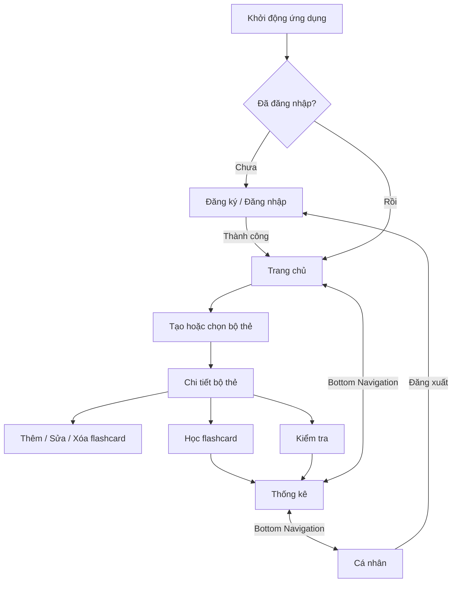

# Flashcard Pro

Ứng dụng học từ vựng bằng flashcard được xây dựng bằng Flutter và Firebase. Người dùng có thể tạo bộ thẻ, học bằng cách lật thẻ, làm bài kiểm tra và theo dõi tiến độ trên Android hoặc iOS.

## Mục lục

- [Ảnh giao diện](#ảnh-giao-diện)
- [Chức năng chính](#chức-năng-chính)
- [Màn hình và điều hướng](#màn-hình-và-điều-hướng)
- [Luồng hoạt động](#luồng-hoạt-động)
- [Công nghệ](#công-nghệ)
- [Cấu trúc dự án](#cấu-trúc-dự-án)
- [Cài đặt và chạy dự án](#cài-đặt-và-chạy-dự-án)
- [Kiểm thử](#kiểm-thử)
- [Phân công](#phân-công)
- [Mã nguồn trọng tâm](#mã-nguồn-trọng-tâm)
- [Lịch sử commit](#lịch-sử-commit)

## Ảnh giao diện

Ba màn hình chính được truy cập bằng `BottomNavigationBar`:

<table>
  <tr>
    <th>Trang chủ</th>
    <th>Thống kê</th>
    <th>Cá nhân</th>
  </tr>
  <tr>
    <td></td>
    <td></td>
    <td></td>
  </tr>
</table>

## Chức năng chính

- Đăng ký, đăng nhập, đăng xuất và đặt lại mật khẩu qua email.
- Đồng bộ dữ liệu theo tài khoản bằng Cloud Firestore.
- Tạo, tìm kiếm, đổi tên và xóa bộ flashcard.
- Thêm, sửa và xóa thẻ gồm từ vựng, nghĩa, ghi chú và ảnh.
- Học bằng cách lật thẻ, chuyển thẻ, trộn thứ tự và đánh dấu thành thạo.
- Kiểm tra bằng cách nhập đáp án; hiển thị số câu đúng, sai và tỷ lệ đúng.
- Theo dõi tổng số bộ, số thẻ, mục tiêu ngày, tiến độ và chuỗi ngày học.
- Chuyển đổi giao diện sáng/tối và lưu cài đặt theo tài khoản.

## Màn hình và điều hướng

Ứng dụng gồm 10 màn hình nghiệp vụ:

| STT | Màn hình | File chính | Cách truy cập |
|---:|---|---|---|
| 1 | Đăng ký | `lib/pages/register_page.dart` | Khởi động khi chưa đăng nhập |
| 2 | Đăng nhập | `lib/pages/login_page.dart` | Từ màn hình Đăng ký |
| 3 | Trang chủ | `lib/pages/home_page.dart` | Bottom Navigation item 1 |
| 4 | Thống kê | `lib/pages/stats_page.dart` | Bottom Navigation item 2 |
| 5 | Cá nhân | `lib/pages/profile_page.dart` | Bottom Navigation item 3 |
| 6 | Tạo bộ thẻ | `lib/pages/add_set_page.dart` | Nút `+` tại Trang chủ |
| 7 | Chi tiết bộ thẻ | `lib/pages/set_detail_page.dart` | Chọn một bộ thẻ |
| 8 | Thêm/Sửa flashcard | `lib/pages/add_edit_flashcard_page.dart` | Nút `+` hoặc chọn một thẻ |
| 9 | Học flashcard | `lib/pages/learn_page.dart` | Nút **Học ngay** |
| 10 | Kiểm tra | `lib/pages/test_page.dart` | Nút **Kiểm tra** |

### Bottom Navigation Bar

Nhóm quyết định sử dụng 3 item chính:

| Item | Icon | Trang | Mục đích |
|---|---|---|---|
| Trang chủ | `Icons.home` | `HomePage` | Quản lý và tìm kiếm bộ thẻ |
| Thống kê | `Icons.bar_chart` | `StatsPage` | Theo dõi tiến độ học tập |
| Cá nhân | `Icons.person` | `ProfilePage` | Hồ sơ, mục tiêu, theme và đăng xuất |

Ba trang được đặt trong `IndexedStack` để giữ trạng thái khi người dùng chuyển tab.

## Luồng hoạt động



### Wireframe tóm tắt

```text
┌──────────────────┐  ┌──────────────────┐  ┌──────────────────┐
│ BỘ FLASHCARD     │  │ THỐNG KÊ         │  │ CÁ NHÂN          │
│ [Tìm kiếm......] │  │ Tổng bộ / thẻ    │  │ Avatar + hồ sơ   │
│ Tổng bộ / thẻ    │  │ Hôm nay / streak │  │ Bộ / thẻ / streak│
│ Danh sách bộ     │  │ Biểu đồ tiến độ  │  │ Mục tiêu ngày    │
│              [+] │  │                  │  │ Theme / đăng xuất│
├──────────────────┤  ├──────────────────┤  ├──────────────────┤
│ Home Stats User  │  │ Home Stats User  │  │ Home Stats User  │
└──────────────────┘  └──────────────────┘  └──────────────────┘
```

## Công nghệ

| Thành phần | Công nghệ |
|---|---|
| Framework | Flutter, Dart |
| Xác thực | Firebase Authentication |
| Cơ sở dữ liệu | Cloud Firestore |
| Lưu trữ ảnh | Firebase Storage |
| Quản lý giao diện | Provider |
| Biểu đồ | fl_chart |
| Chọn ảnh | image_picker |

Phiên bản Dart yêu cầu được khai báo trong `pubspec.yaml`: `sdk: ^3.9.0`.

## Cấu trúc dự án

```text
lib/
├── main.dart                 # Khởi tạo Firebase, auth flow và Bottom Navigation
├── firebase_options.dart     # Cấu hình FlutterFire
├── models/                   # User, Flashcard, FlashcardSet, SessionStats
├── pages/                    # Các màn hình của ứng dụng
├── services/                 # AuthService và FlashcardService
├── theme/                    # Light theme và dark theme
└── widgets/                  # FlipCard và các widget dùng lại

test/
└── widget_test.dart          # Smoke test màn hình xác thực

docs/
└── screenshots/              # Ảnh minh chứng ba tab chính

firestore.rules               # Phân quyền dữ liệu Firestore theo UID
storage.rules                 # Phân quyền Firebase Storage theo UID
firebase.json                 # Cấu hình triển khai Firebase
```

## Cài đặt và chạy dự án

### 1. Yêu cầu môi trường

- Flutter SDK tương thích với Dart `^3.9.0`.
- Android Studio/Android SDK hoặc macOS + Xcode.
- Firebase project đã bật Authentication, Firestore và Storage.
- Firebase CLI nếu cần triển khai security rules.

Kiểm tra môi trường:

```bash
flutter doctor
flutter devices
```

### 2. Tải mã nguồn

```bash
git clone https://github.com/GianManhDuc-23010464/nhom_duc_thuy_tung_toan.git
cd nhom_duc_thuy_tung_toan
flutter pub get
```

### 3. Cấu hình Firebase

Repository đã có cấu hình FlutterFire cho Android và iOS. Khi dùng Firebase project khác, chạy lại:

```bash
dart pub global activate flutterfire_cli
flutterfire configure
```

Trong Firebase Console:

1. Bật phương thức **Email/Password** trong Authentication.
2. Tạo Cloud Firestore Database.
3. Khởi tạo Firebase Storage.
4. Triển khai security rules:

```bash
firebase deploy --only firestore:rules,storage
```

### 4. Chạy ứng dụng

```bash
flutter run
```

Chọn thiết bị cụ thể nếu có nhiều thiết bị:

```bash
flutter run -d <device-id>
```

## Kiểm thử

Chạy kiểm tra tĩnh và widget test trước mỗi commit:

```bash
flutter analyze
flutter test
```

Kết quả gần nhất:

- `flutter analyze`: không phát hiện vấn đề.
- `flutter test`: 2/2 test vượt qua.

## Phân công

| Thành viên | Phần việc | File trọng tâm |
|---|---|---|
| Đức | Khung ứng dụng, Firebase Auth và Bottom Navigation | `main.dart`, `login_page.dart`, `register_page.dart` |
| Thủy | Trang chủ và quản lý bộ/thẻ | `home_page.dart`, `set_detail_page.dart`, các trang thêm/sửa |
| Tùng | Thống kê và màn hình học | `stats_page.dart`, `learn_page.dart`, `flip_card.dart` |
| Toàn | Cá nhân và kiểm tra | `profile_page.dart`, `test_page.dart`, `app_theme.dart` |

> Phân công cần được đối chiếu lại với danh sách chính thức của nhóm trước khi nộp.

## Mã nguồn trọng tâm

### Bottom Navigation Bar

```dart
Scaffold(
  body: IndexedStack(index: _currentIndex, children: _pages),
  bottomNavigationBar: BottomNavigationBar(
    currentIndex: _currentIndex,
    onTap: (index) => setState(() => _currentIndex = index),
    type: BottomNavigationBarType.fixed,
    items: const [
      BottomNavigationBarItem(
        icon: Icon(Icons.home),
        label: 'Trang chủ',
      ),
      BottomNavigationBarItem(
        icon: Icon(Icons.bar_chart),
        label: 'Thống kê',
      ),
      BottomNavigationBarItem(
        icon: Icon(Icons.person),
        label: 'Cá nhân',
      ),
    ],
  ),
);
```

Mã nguồn đầy đủ:

- Bottom Navigation: [`lib/main.dart`](lib/main.dart)
- Trang chủ: [`lib/pages/home_page.dart`](lib/pages/home_page.dart)
- Thống kê: [`lib/pages/stats_page.dart`](lib/pages/stats_page.dart)
- Cá nhân: [`lib/pages/profile_page.dart`](lib/pages/profile_page.dart)
- Học: [`lib/pages/learn_page.dart`](lib/pages/learn_page.dart)
- Kiểm tra: [`lib/pages/test_page.dart`](lib/pages/test_page.dart)

## Lịch sử commit

- [Cấu hình Firebase cho Android và iOS](https://github.com/GianManhDuc-23010464/nhom_duc_thuy_tung_toan/commit/5bd44ef)
- [Bổ sung tài liệu dự án](https://github.com/GianManhDuc-23010464/nhom_duc_thuy_tung_toan/commit/286a0c6)
- [Thêm ứng dụng Flutter Flashcard](https://github.com/GianManhDuc-23010464/nhom_duc_thuy_tung_toan/commit/a25a93f)
- [Commit của thành viên Đình Tùng](https://github.com/GianManhDuc-23010464/nhom_duc_thuy_tung_toan/commit/0e4a124)
- [Toàn bộ lịch sử commit](https://github.com/GianManhDuc-23010464/nhom_duc_thuy_tung_toan/commits/main/)

## Bảo mật và dữ liệu

- Firestore và Storage chỉ cho phép người dùng đã đăng nhập truy cập dữ liệu trong đường dẫn UID của chính họ.
- Không lưu mật khẩu trong Firestore hoặc bộ nhớ cục bộ.
- Không commit service-account key hoặc thông tin đăng nhập cá nhân vào repository.
- Cấu hình Firebase phía client không thay thế cho security rules; luôn triển khai rules trước khi demo hoặc phát hành.

## Giấy phép

Dự án phục vụ mục đích học tập. Nhóm có thể bổ sung giấy phép chính thức nếu công khai hoặc tái sử dụng mã nguồn.
