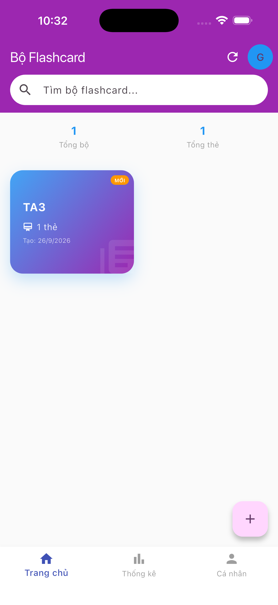
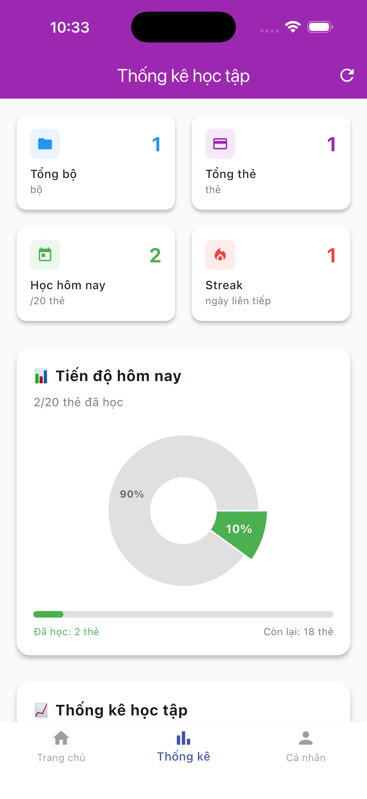
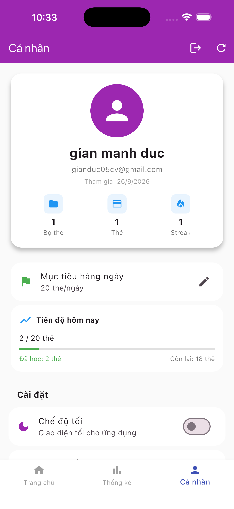
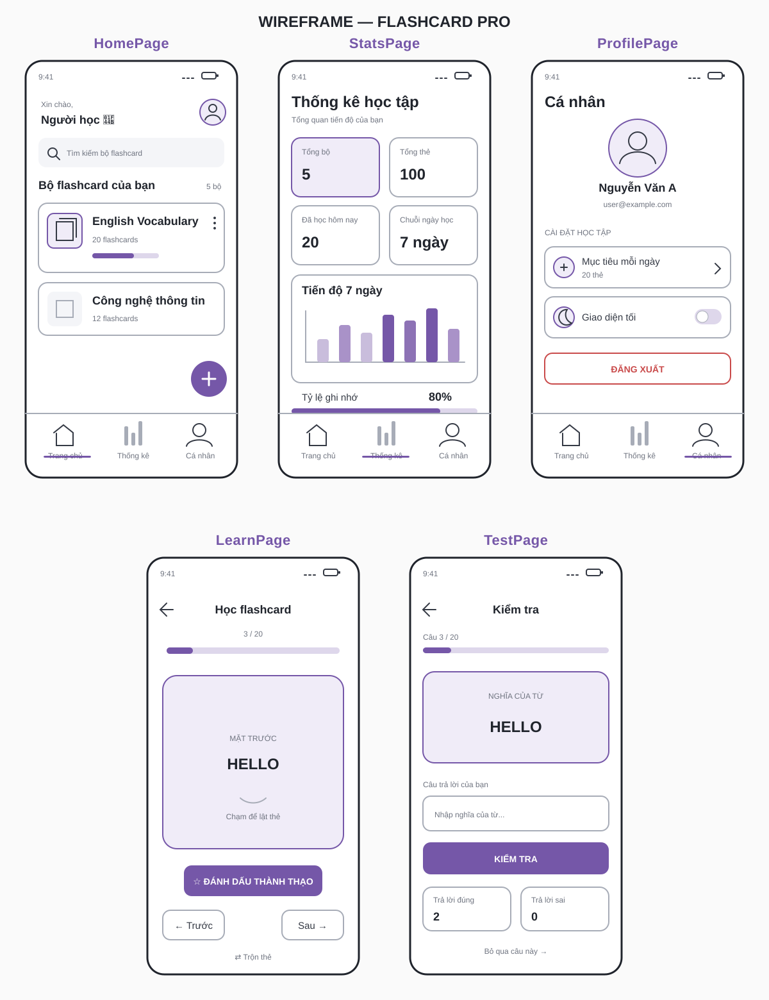
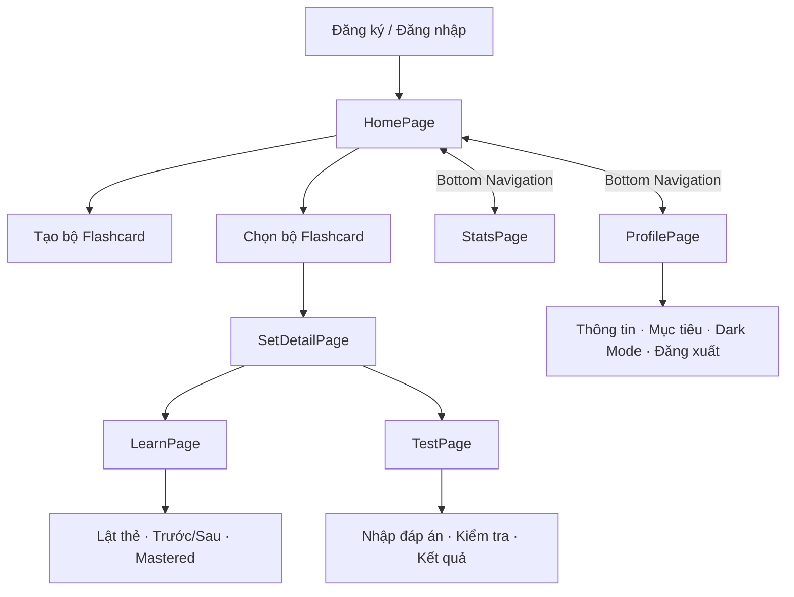

# Flashcard Pro

Ứng dụng học từ vựng bằng flashcard được xây dựng bằng Flutter và Firebase. Người dùng có thể tạo bộ thẻ, học bằng cách lật thẻ, làm bài kiểm tra và theo dõi tiến độ trên Android hoặc iOS.

## Mục lục

- [Ảnh giao diện](#ảnh-giao-diện)
- [Chức năng chính](#chức-năng-chính)
- [1. Wireframe và Flow of Work](#1-wireframe-các-màn-hình-và-flow-of-work)
- [2. Số lượng màn hình và Bottom Navigation Bar](#2-số-lượng-màn-hình-và-bottom-navigation-bar)
- [3. Phân công công việc](#3-phân-công-công-việc)
- [4. Commit code vào repository chung](#4-commit-code-vào-repository-chung)
- [Công nghệ](#công-nghệ)
- [Cấu trúc dự án](#cấu-trúc-dự-án)
- [Cài đặt và chạy dự án](#cài-đặt-và-chạy-dự-án)
- [Kiểm thử](#kiểm-thử)
- [Lịch sử commit](#lịch-sử-commit)

## Ảnh giao diện

Ba màn hình chính được truy cập bằng `BottomNavigationBar`:

<table>
  <tr>
    <th>Trang chủ</th>
    <th>Thống kê</th>
    <th>Cá nhân</th>
  </tr>
  <tr>
    <td></td>
    <td></td>
    <td></td>
  </tr>
</table>

## Chức năng chính

- Đăng ký, đăng nhập, đăng xuất và đặt lại mật khẩu qua email.
- Đồng bộ dữ liệu theo tài khoản bằng Cloud Firestore.
- Tạo, tìm kiếm, đổi tên và xóa bộ flashcard.
- Thêm, sửa và xóa thẻ gồm từ vựng, nghĩa, ghi chú và ảnh.
- Học bằng cách lật thẻ, chuyển thẻ, trộn thứ tự và đánh dấu thành thạo.
- Kiểm tra bằng cách nhập đáp án; hiển thị số câu đúng, sai và tỷ lệ đúng.
- Theo dõi tổng số bộ, số thẻ, mục tiêu ngày, tiến độ và chuỗi ngày học.
- Chuyển đổi giao diện sáng/tối và lưu cài đặt theo tài khoản.

## 1. Wireframe các màn hình và Flow of Work

Ứng dụng có 5 màn hình chức năng chính: `HomePage`, `StatsPage`, `ProfilePage`, `LearnPage` và `TestPage`. Các màn hình hỗ trợ gồm `LoginPage`, `RegisterPage`, `SetDetailPage`, `AddSetPage` và `AddEditFlashcardPage`.

### Wireframe giao diện

<p align="center">
  
</p>

| Màn hình | Nội dung và thao tác chính |
|---|---|
| `HomePage` | Lời chào, tìm kiếm, danh sách bộ thẻ, số lượng thẻ, tạo mới, đổi tên, xóa và mở bộ flashcard. |
| `StatsPage` | Tổng số bộ/thẻ, số thẻ đã học, mục tiêu ngày, chuỗi ngày học, tỷ lệ ghi nhớ và biểu đồ tiến độ. |
| `ProfilePage` | Avatar, tên, email, mục tiêu học mỗi ngày, giao diện sáng/tối và đăng xuất. |
| `LearnPage` | Tiến độ học, lật thẻ, chuyển thẻ, trộn thứ tự và đánh dấu thẻ thành thạo. |
| `TestPage` | Câu hỏi, ô nhập đáp án, kiểm tra đúng/sai, bỏ qua và thống kê kết quả. |

### Flow of Work



## 2. Số lượng màn hình và Bottom Navigation Bar

Nhóm quyết định có 5 màn hình chức năng chính:

1. `HomePage`
2. `StatsPage`
3. `ProfilePage`
4. `LearnPage`
5. `TestPage`

Bottom Navigation Bar chỉ gồm 3 màn hình thường xuyên được truy cập:

- `HomePage`
- `StatsPage`
- `ProfilePage`

`LearnPage` và `TestPage` không nằm trực tiếp trong Bottom Navigation Bar. Hai trang được truy cập theo luồng:

```text
HomePage → SetDetailPage → LearnPage / TestPage
```

Code thực tế trong `lib/main.dart`:

```dart
final List<Widget> _pages = [
  const HomePage(),
  const StatsPage(),
  const ProfilePage(),
];

Widget _buildMainApp() {
  return Scaffold(
    body: IndexedStack(index: _currentIndex, children: _pages),
    bottomNavigationBar: BottomNavigationBar(
      currentIndex: _currentIndex,
      onTap: (index) => setState(() => _currentIndex = index),
      backgroundColor: _themeMode == ThemeMode.dark
          ? const Color(0xFF1E1E1E)
          : Colors.white,
      selectedItemColor: _themeMode == ThemeMode.dark
          ? const Color(0xFF9C27B0)
          : const Color(0xFF3F51B5),
      unselectedItemColor: Colors.grey,
      selectedLabelStyle: const TextStyle(fontWeight: FontWeight.w500),
      type: BottomNavigationBarType.fixed,
      items: const [
        BottomNavigationBarItem(
          icon: Icon(Icons.home),
          label: 'Trang chủ',
        ),
        BottomNavigationBarItem(
          icon: Icon(Icons.bar_chart),
          label: 'Thống kê',
        ),
        BottomNavigationBarItem(
          icon: Icon(Icons.person),
          label: 'Cá nhân',
        ),
      ],
    ),
  );
}
```

Mã nguồn đầy đủ:

- Bottom Navigation: [`lib/main.dart`](lib/main.dart)
- Trang chủ: [`lib/pages/home_page.dart`](lib/pages/home_page.dart)
- Thống kê: [`lib/pages/stats_page.dart`](lib/pages/stats_page.dart)
- Cá nhân: [`lib/pages/profile_page.dart`](lib/pages/profile_page.dart)
- Học: [`lib/pages/learn_page.dart`](lib/pages/learn_page.dart)
- Kiểm tra: [`lib/pages/test_page.dart`](lib/pages/test_page.dart)

## 3. Phân công công việc

| Sinh viên | Màn hình phụ trách | File chính |
|---|---|---|
| Đức | HomePage | `lib/pages/home_page.dart` |
| Tùng (Nguyễn Đình Tùng) | StatsPage | `lib/pages/stats_page.dart` |
| Thủy | ProfilePage | `lib/pages/profile_page.dart` |
| Toàn | LearnPage / TestPage | `lib/pages/learn_page.dart`, `lib/pages/test_page.dart` |

### Đức - HomePage

- Hiển thị danh sách bộ Flashcard và số lượng thẻ.
- Tìm kiếm, tạo, sửa và xóa bộ Flashcard.
- Mở chi tiết bộ Flashcard.
- Điều hướng tới luồng học và kiểm tra thông qua `SetDetailPage`.

### Tùng (Nguyễn Đình Tùng) - StatsPage

- Hiển thị tổng số bộ, tổng số thẻ và số thẻ đã học.
- Hiển thị mục tiêu hàng ngày, streak và tỷ lệ ghi nhớ.
- Trình bày biểu đồ thống kê học tập.

### Thủy - ProfilePage

- Hiển thị thông tin người dùng, tên và email.
- Thay đổi mục tiêu học mỗi ngày.
- Bật/tắt Dark Mode.
- Đăng xuất khỏi ứng dụng.

### Toàn - LearnPage / TestPage

LearnPage:

- Hiển thị, lật và chuyển flashcard.
- Trộn thứ tự thẻ.
- Đánh dấu thẻ mastered.

TestPage:

- Hiển thị câu hỏi và nhận đáp án người dùng.
- Kiểm tra đúng/sai.
- Thống kê số câu đúng/sai và hiển thị kết quả.

## 4. Commit code vào repository chung

Repository của nhóm:

<https://github.com/GianManhDuc-23010464/nhom_duc_thuy_tung_toan>

Quy trình commit; chỉ push sau khi nhóm xác nhận:

```bash
git status
git add <cac-file-duoc-phan-cong>
git commit -m "docs: update wireframes flow and team assignment"
```

Sau khi được xác nhận, push branch hiện tại lên remote. Ví dụ với `main`:

```bash
git push origin main
```

Mỗi sinh viên cần có commit riêng cho phần code được phân công để lịch sử Git thể hiện rõ đóng góp:

```text
Đức:  feat: implement home page
Tùng:  feat: implement statistics page
Thủy:  feat: implement profile page
Toàn:  feat: implement learn and test pages
```

## Công nghệ

| Thành phần | Công nghệ |
|---|---|
| Framework | Flutter, Dart |
| Xác thực | Firebase Authentication |
| Cơ sở dữ liệu | Cloud Firestore |
| Lưu trữ ảnh | Firebase Storage |
| Quản lý giao diện | Provider |
| Biểu đồ | fl_chart |
| Chọn ảnh | image_picker |

Phiên bản Dart yêu cầu được khai báo trong `pubspec.yaml`: `sdk: ^3.9.0`.

## Cấu trúc dự án

```text
lib/
├── main.dart                 # Khởi tạo Firebase, auth flow và Bottom Navigation
├── firebase_options.dart     # Cấu hình FlutterFire
├── models/                   # User, Flashcard, FlashcardSet, SessionStats
├── pages/                    # Các màn hình của ứng dụng
├── services/                 # AuthService và FlashcardService
├── theme/                    # Light theme và dark theme
└── widgets/                  # FlipCard và các widget dùng lại

test/
└── widget_test.dart          # Smoke test màn hình xác thực

docs/
├── screenshots/              # Ảnh minh chứng ba tab chính
└── wireframes/               # Wireframe đồ họa năm màn hình chính

firestore.rules               # Phân quyền dữ liệu Firestore theo UID
storage.rules                 # Phân quyền Firebase Storage theo UID
firebase.json                 # Cấu hình triển khai Firebase
```

## Cài đặt và chạy dự án

### 1. Yêu cầu môi trường

- Flutter SDK tương thích với Dart `^3.9.0`.
- Android Studio/Android SDK hoặc macOS + Xcode.
- Firebase project đã bật Authentication, Firestore và Storage.
- Firebase CLI nếu cần triển khai security rules.

Kiểm tra môi trường:

```bash
flutter doctor
flutter devices
```

### 2. Tải mã nguồn

```bash
git clone https://github.com/GianManhDuc-23010464/nhom_duc_thuy_tung_toan.git
cd nhom_duc_thuy_tung_toan
flutter pub get
```

### 3. Cấu hình Firebase

Repository đã có cấu hình FlutterFire cho Android và iOS. Khi dùng Firebase project khác, chạy lại:

```bash
dart pub global activate flutterfire_cli
flutterfire configure
```

Trong Firebase Console:

1. Bật phương thức **Email/Password** trong Authentication.
2. Tạo Cloud Firestore Database.
3. Khởi tạo Firebase Storage.
4. Triển khai security rules:

```bash
firebase deploy --only firestore:rules,storage
```

### 4. Chạy ứng dụng

```bash
flutter run
```

Chọn thiết bị cụ thể nếu có nhiều thiết bị:

```bash
flutter run -d <device-id>
```

## Kiểm thử

Chạy kiểm tra tĩnh và widget test trước mỗi commit:

```bash
flutter analyze
flutter test
```

Kết quả gần nhất:

- `flutter analyze`: không phát hiện vấn đề.
- `flutter test`: 2/2 test vượt qua.

## Lịch sử commit

- [Cấu hình Firebase cho Android và iOS](https://github.com/GianManhDuc-23010464/nhom_duc_thuy_tung_toan/commit/5bd44ef)
- [Bổ sung tài liệu dự án](https://github.com/GianManhDuc-23010464/nhom_duc_thuy_tung_toan/commit/286a0c6)
- [Thêm ứng dụng Flutter Flashcard](https://github.com/GianManhDuc-23010464/nhom_duc_thuy_tung_toan/commit/a25a93f)
- [Commit của thành viên Đình Tùng](https://github.com/GianManhDuc-23010464/nhom_duc_thuy_tung_toan/commit/0e4a124)
- [Toàn bộ lịch sử commit](https://github.com/GianManhDuc-23010464/nhom_duc_thuy_tung_toan/commits/main/)

## Bảo mật và dữ liệu

- Firestore và Storage chỉ cho phép người dùng đã đăng nhập truy cập dữ liệu trong đường dẫn UID của chính họ.
- Không lưu mật khẩu trong Firestore hoặc bộ nhớ cục bộ.
- Không commit service-account key hoặc thông tin đăng nhập cá nhân vào repository.
- Cấu hình Firebase phía client không thay thế cho security rules; luôn triển khai rules trước khi demo hoặc phát hành.

## Giấy phép

Dự án phục vụ mục đích học tập. Nhóm có thể bổ sung giấy phép chính thức nếu công khai hoặc tái sử dụng mã nguồn.
